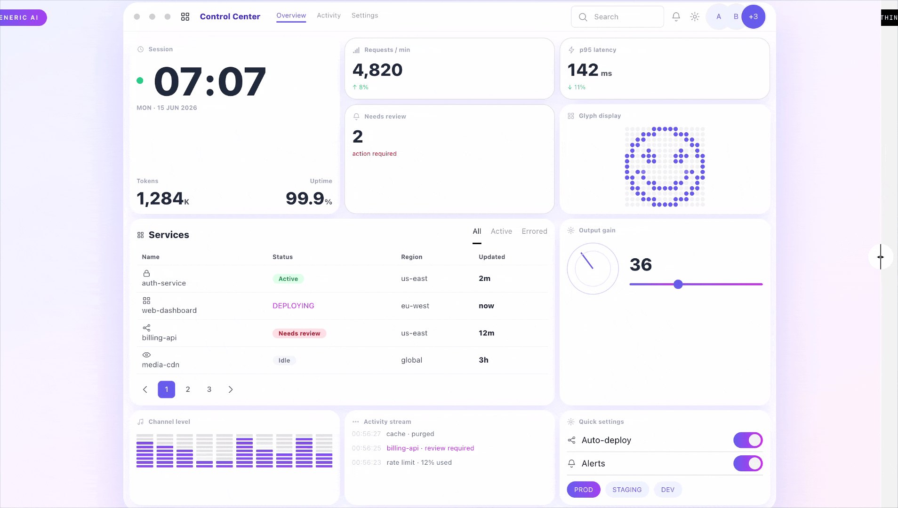
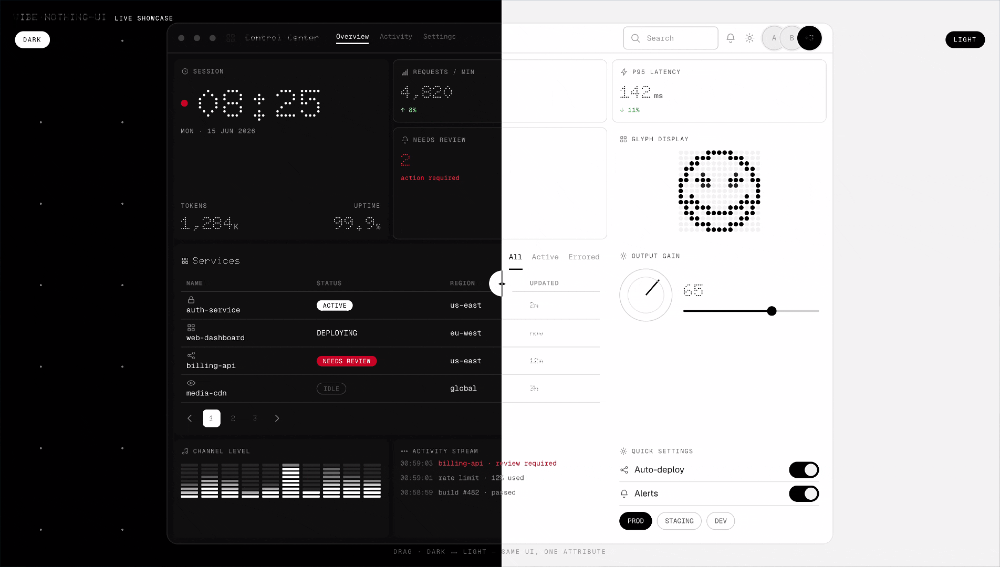
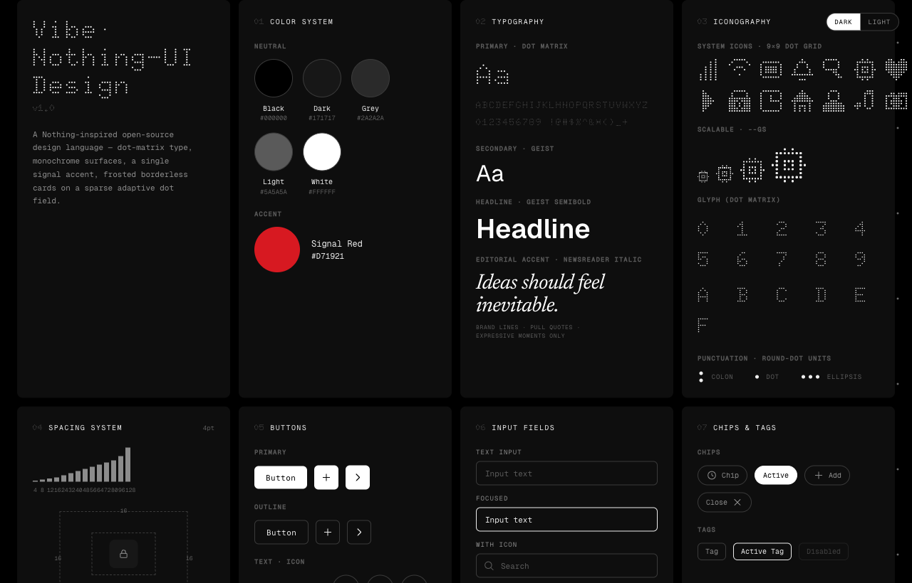

<div align="center">


[](LICENSE)
[](#quick-start)
[](https://wangbh030722.github.io/vibe-nothing-ui-design/)

**A Nothing-inspired UI component library for the web.**

Not a spec or a ruleset — actual, ready-to-use components you copy in and ship: buttons, inputs, tables, navigation, cards, dialogs, an applied app screen, and more. Monochrome surfaces · round-dot type & icons · a single signal-red accent · a sparse dot field that inverts against whatever sits behind it. Zero dependencies — pure HTML, CSS custom properties, and a little vanilla JavaScript. No framework, no build step.

**[Live demo](https://wangbh030722.github.io/vibe-nothing-ui-design/demo.html)** · **[All components](https://wangbh030722.github.io/vibe-nothing-ui-design/)** · **[SPEC.md](SPEC.md)** · **[DESIGN.md](DESIGN.md)**

</div>

---

<div align="center">

### Generic AI output ⟷ Vibe-Nothing-UI

*Drag the divider — same content, default AI styling on the left, this system on the right.*



### Dark ⟷ Light — one attribute



</div>

## Quick start

```html
<link rel="stylesheet" href="css/nothing-ui.css">

<body data-theme="dark">
  <button class="btn btn-primary">Run agent</button>
</body>

<script src="js/nothing-ui.js"></script>
```

Keep the bundled `fonts/open/` folder next to the CSS, and switch theme on any ancestor:

```html
<main data-theme="light">…</main>
```

No package manager, no compiler — copy the files into any static site, or take the tokens into your own stack.

## Components

Foundations, forms, navigation, feedback, data display, dynamic controls, and an applied app screen — 46 components, all in two themes.




### An applied screen

A complete application view assembled only from the library — sidebar navigation, breadcrumb, search, a data table with status pills, and pagination. The accent red shows up only on genuine signals (deploying, needs review). [See it live →](https://wangbh030722.github.io/vibe-nothing-ui-design/)

### Glyph Matrix

A canonical 25×25 circular-masked dot panel (the Phone (3) grid), plus scalable 9×9 interface icons.


## Principles

- Black, grey, and white carry the hierarchy; the accent is reserved for live / blocked / needs-input signals.
- Controls use black↔white inversion, never the accent color.
- Depth comes from hairlines, whitespace, and frosted glass — no shadows, no gradients.
- One round-dot geometry runs through type, icons, and status glyphs.
- Functional UI stays sans-serif; an editorial italic appears only in page-level copy, never inside a component.

## Fonts

Self-contained and open: **Doto** (round-dot display), **Geist** (UI & headlines), **Geist Mono** (labels & data), and **Newsreader Italic** (editorial accent). All bundled files are SIL OFL 1.1 — sources and licenses in [`fonts/open/`](fonts/open). No proprietary fonts are included or required.

## Documentation

- **[SPEC.md](SPEC.md)** — the normative generation contract: exact tokens, hard rules, component recipes, and a release checklist. Hand it to an AI assistant to generate compatible UI.
- **[DESIGN.md](DESIGN.md)** — the design rationale and decision history.

The rendered `index.html` is the visual source of truth.

## License & trademark

Code under the [MIT License](LICENSE). This is an independent, community project inspired by Nothing's visual language — not affiliated with, endorsed by, or sponsored by Nothing Technology Limited. "Nothing", "NDot", and "NType" are trademarks or assets of their respective owners; none are included here.
